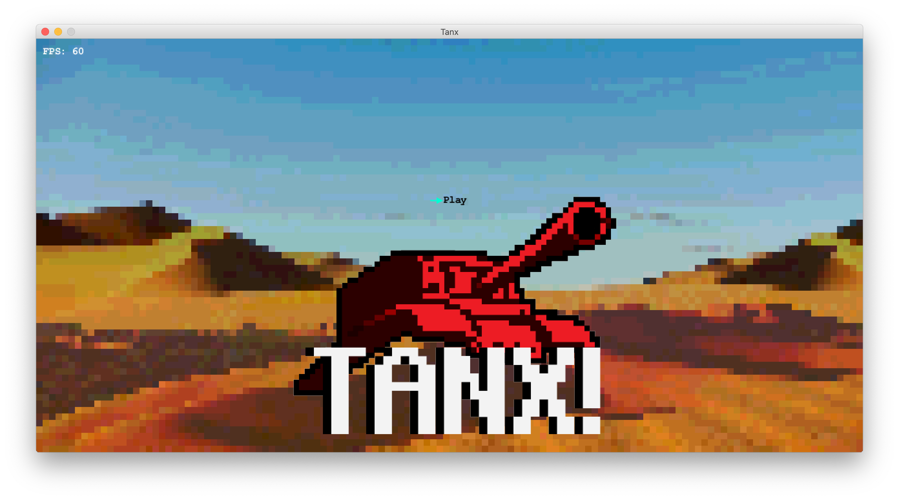
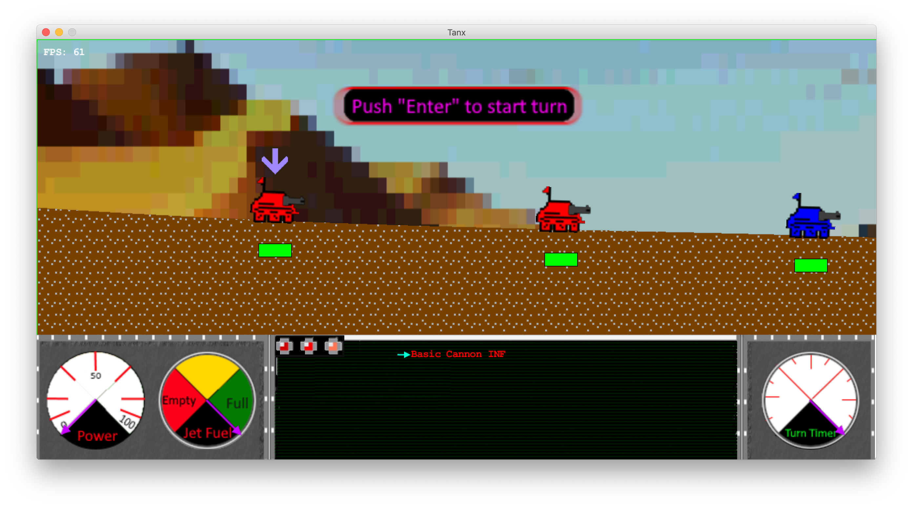
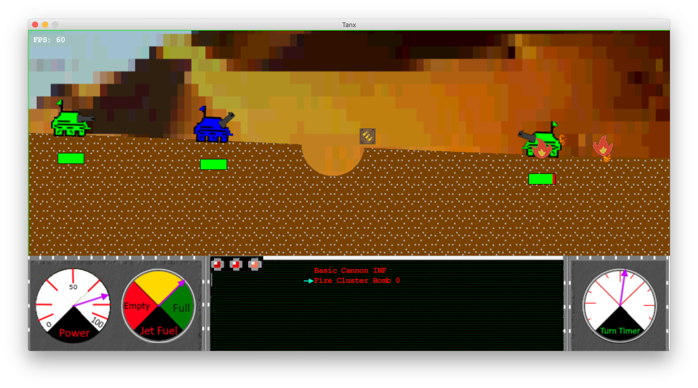
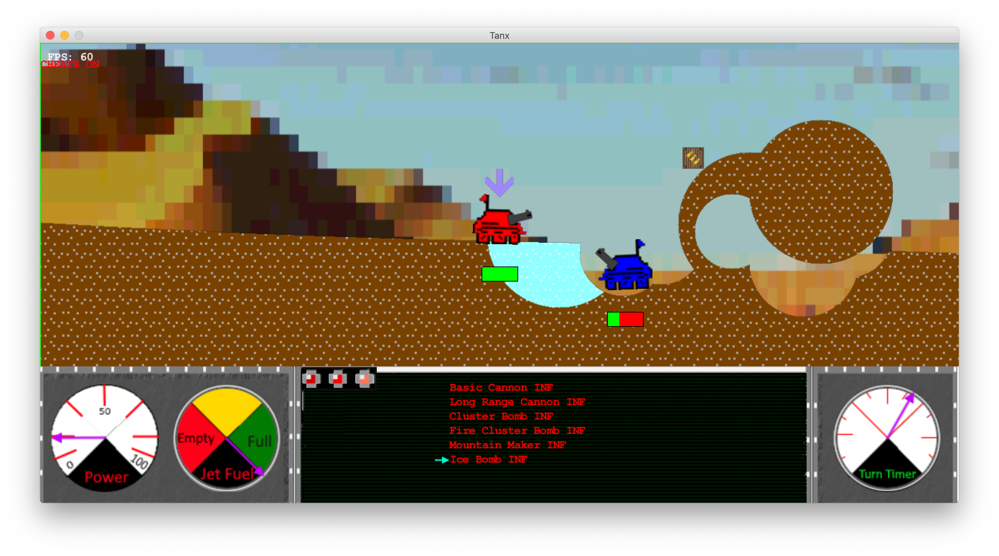

# CS447 Project 2: Tanx!
Tanx - Release version 1.1.

A game created and produced by Matthew Schofield, Joseph Van Boxtel, Benjamin Eavenson, and Henry Unruh for WSU's CS447 Game Design course.

## Tanx - What is it?
Tanx is a hotseat multiplayer game in which players take turns controlling one of their tanks, moving it across the battlefield and making an attack. There are multiple weapons and abilities at the players’ disposal. Whomever is the last player with living tanks is the winner.

The players take turns controlling one of their own tanks. Each turn they control a different tank and it changes sequentially. The current player can control the pitch of the cannon and shoot it. There will be a one shot per turn restriction. Players can cycle through different attacks using the keyboard. There will be power ups throughout the Battlefield that are gained by colliding with them.

## How To Play
- W - Raise cannon
- S - Lower cannon
- A - Move tank left
- D - Move tank right
- Space - Use jets to jump
- R - Cycle weapons(up)
- F - Cycle weapons(down)
- LShift(hold) - Charge weapon to fire
- LShift(release) - Fire charged shot from tank
- Enter - Start turn
- Minus(-) - Zoom out
- Equals(=) - Zoom in

## Powerups
- Health pickup
- Weapon pickups:
  - Basic Cannon: (Medium damage, average range, single shot)
  - Long Cannon: (High damage, high range, single shot)
  - Cluster Bomb Cannon: (Low damage, average range, single shot-five bombs)
  - Fire Cluster Bomb Cannon: (Low damage, average range, single shot. Fires three bombs which have three-turn fire damage)
  - Ice Bomb Cannon: (Low damage, average range, single shot. Creates an ice patch on hit)
  - Mountain-Maker: (Low damage, average range, single shot. Creates terrain on hit)
  
## Powerup interactions
- Fire bombs will take fire damage over the course of three turns. Fires will remain on the map for five turns and will melt icy terrain.
- Ice bombs will create icy terrain. This will change the movement of the terrain to be more slippery and less precise.
- Montain-Maker will create terrain on projectile hit and will put out fires.

## Cheats
- 1 - Toggle Cheats on
- 2 - Give all weapons to current player with infinite ammo
- 3 - Toggle infinite jump jet fuel
- 4 - Toggle infinite health on current tank
- 5 - Kill current tank
- 6 - Show debug rays for rotation handling
- T - moves tank to cursor
- X - makes hole based on cursor position
- I - makes ice around cursor position

## Low-bar
- [x] Player Controlled Tanks
  - Players will be able to move their tanks during their turns. This will be most likely
achieved with the wasd keys
- [x] World Scrolling
  - The camera will automatically track the active entity, but the player will have the
option to take manual control.
- [x] Turn System
  - Players will have a time limit for their turn and their turn will end when they either
run out of time or fire a shot. After the shot is resolved, the turn will switch over to
the other player.
- [x] Gravity for objects
  - Tanks and projectiles will be affected by gravity.
- [x] Destructible Terrain
  - Certain projectiles or items can affect and interact with the environment, creating
“pockets” or removing chunks of material from the playspace.
- [x] Terrain Types
  - There will be multiple types of terrain that have different effects on movement
and status of the tanks.
- [x] Powerups
- [x] Weapons
  - There will be multiple weapons that the player can pick up and use, each
with unique effects.
- [x] Movement Abilities
  - There will be multiple tools that the player can pick up and use to enhance their movement options.
  - NOTE: We have changed this point slightly, we have made basic movement abilities a core feature rather than a pickup such as jump-jets and slipping on ice.
- [x] Art
  - Visual entities will be represented by sprites.
  
## High-bar/features
 - Complex sprite art
  - We have sprites that will mirror in the direction that the cannon is facing as well as code to determine tank color.
 - Procedurally generated terrain
  - Maps will have varying heights and valleys on every game load!
 - Terrain interaction
  - The map will dynamically change based on the actions that take place in the game: stuff like the "Mountain Maker" as well as ice will interact with fires!
 - Bitmap-based terrain
  - Terrain is represented as a 2D array of pixels which allows for simple terrain checking at various positions.
 - Tank rotation & slope interations
  - The tanks will rotate and mirror based on the state of the tank. Tanks will interact with mountains and valleys.

## License
We give Scott Wallace permission to use this project in any non-commercial manner, provided we are credited as
the creator of all graphical artwork and code (not including the code provided by the jig and slick libraries).
